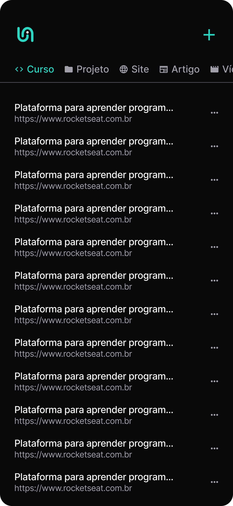
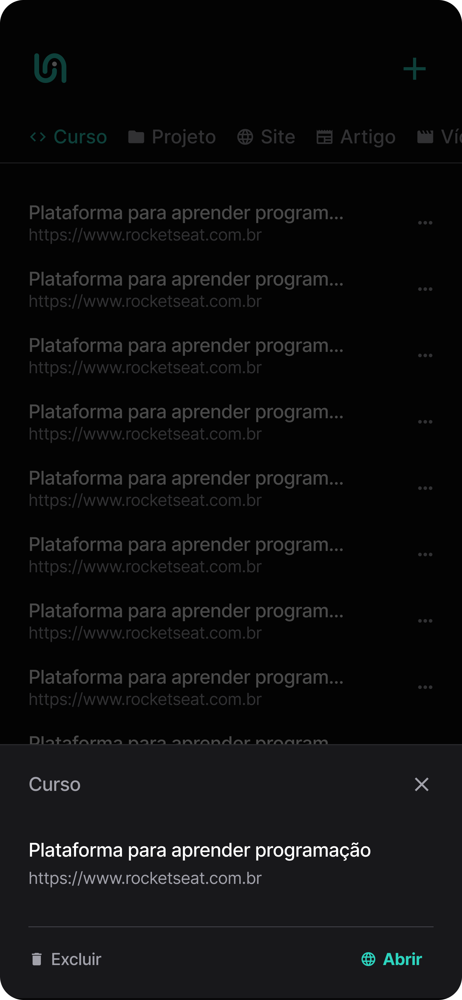

<h1 align="center"> APP de Link </h1>

 

  

  

  

## 🚀 Tecnologias

Esse projeto está sendo desenvolvido com as seguintes tecnologias:

- JavaScript
- TypeScript
- Reactnative
- React
- Expo

## 💻 Projeto

O projeto é uma aplicação mobile para salvar e organizar links importantes, como artigos, vídeos e cursos. É um aplicativo muito útil para ter e utilizar no dia-a-dia!

## Como Executar o Projeto

Clonar este repositório

Instalar as dependências

npm install

expo start

Utilize o aplicativo Expo Go em seu dispositivo móvel ou um emulador para visualizar o aplicativo.